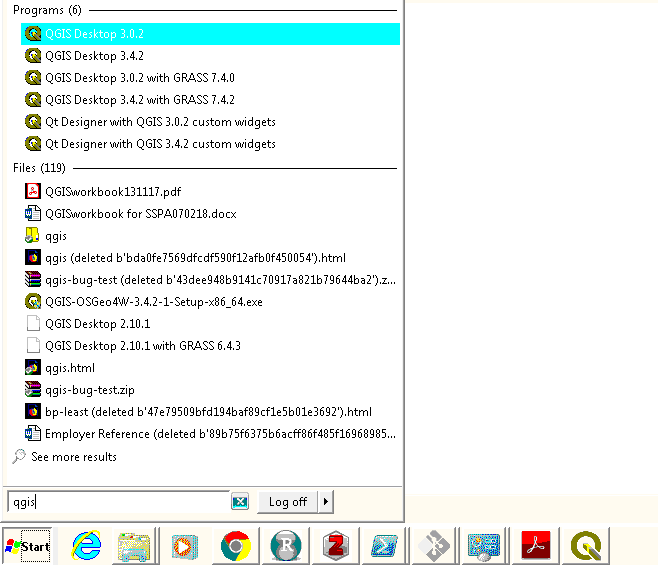

# Working with QGIS

```{r}
knitr::opts_chunk$set(echo = FALSE, out.width = "100%")
```


Before importing data (covered in Chapter \@ref(data)) it is worth getting to know QGIS, in terms of its main components, how to get help, and how it helps you organise your work into projects.

## Opening QGIS

Probably the quickest way to open QGIS on your computer press 'Windows button' on your keyboard and type 'qgis' (see Figure \@ref(fig:qgis-start)).

<!-- \begin{wrapfigure}{R}   -->
<!--  \begin{center} -->

```{r qgis-start, fig.cap="Starting QGIS", out.width="50%"}
# Idea: wrapfigure: https://stackoverflow.com/questions/44845699/

```

<!-- \end{center} -->
<!-- \end{wrapfigure} -->

Select 'QGIS Desktop' from the list.
If you have multiple versions, choose the latest version.
You should see a new window appear that contains the main features of the QGIS program (see Figure \@ref(fig:qgis-window)).
These include the following main components, numbered from 1:5 in the figure and the bullet points below (source: the [QGIS Manual](https://docs.qgis.org/2.18/en/docs/user_manual/)):

1. Menu Bar: like most GUI-based programs you can control key aspects of QGIS and execute key commands, like saving your project and loading new datasets, by clicking Project or Layer.  Note: shortcuts to access these menus from the keyboard are `Alt+J` and `Alt+L`, respectively.
1. Toolbars: these are small icons located towards the top and left hand side of Figure \@ref(fig:qgis-window). In addition to options available from the Menu Bar, these icons provide tools for interacting with the map such as Pan (the hand symbol) and Zoom (the + and - signs).
1. Panels: Panels are interactive elements that show information on particular aspects of the project. A view of files in the Browser Panel and the Layers Panel are shown in Figure \@ref(fig:qgis-window). 
1. Map View: this is where the geographic data is displayed in an interactive map for interactive visualisation.
1. Status Bar: this small but important element at the bottom of QGIS shows details about the current status of the Map View, such as the Coordinate Reference System (CRS), in this case EPSG:2964 and scale.


```{r qgis-window, fig.cap="QGIS after opening it for the first time"}
knitr::include_graphics("figures/startup.png")
```

