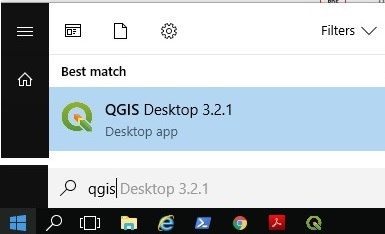
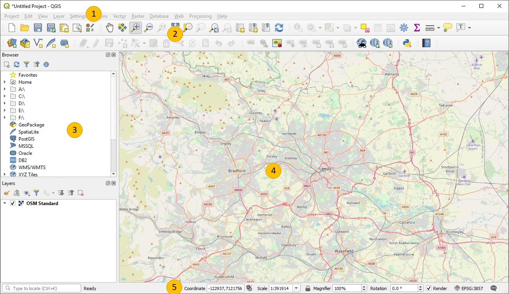
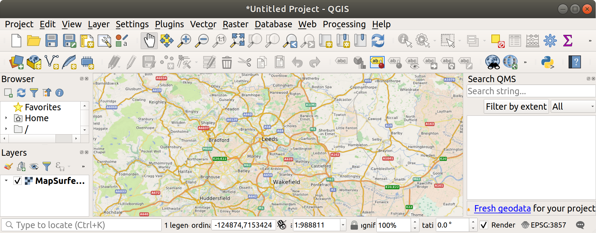
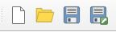
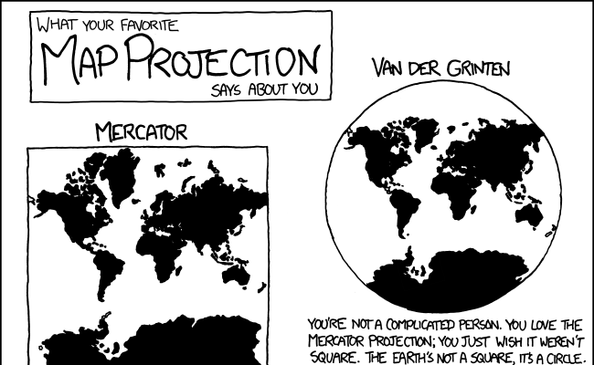

# Working with QGIS

```{r, include=FALSE}
knitr::opts_chunk$set(echo = FALSE, out.width = "100%")
```

Before importing data (covered in Chapter \@ref(data)) it is worth getting to know QGIS, in terms of its main components, how to get help, and how it helps you organise your work into projects.
This chapter describes some of QGIS's key elements and 

## Opening QGIS

Probably the quickest way to open QGIS on your computer press 'Windows button' on your keyboard and type 'qgis' (see Figure \@ref(fig:qgis-start)).

<!-- \begin{wrapfigure}{R}   -->
<!--  \begin{center} -->

```{r qgis-start, fig.cap="Starting QGIS", out.width="50%"}
# Idea: wrapfigure: https://stackoverflow.com/questions/44845699/

```

<!-- \end{center} -->
<!-- \end{wrapfigure} -->

Select 'QGIS Desktop' from the list.
If you have multiple versions, choose the latest version.
You should see a new window appear that contains the main features of the QGIS program (see Figure \@ref(fig:qgis-window)).

## Key QGIS components

These include the following main components, numbered from 1:5 in the figure and the bullet points below (source: the [QGIS Manual](https://docs.qgis.org/2.18/en/docs/user_manual/)):

1. Menu Bar: like most GUI-based programs you can control key aspects of QGIS and execute key commands, like saving your project and loading new datasets, by clicking Project or Layer.  Note: shortcuts to access these menus from the keyboard are `Alt+J` and `Alt+L`, respectively.
1. Toolbars: these are small icons located towards the top and left-hand side of Figure \@ref(fig:qgis-window). In addition to options available from the Menu Bar, these icons provide tools for interacting with the map such as Pan (the hand symbol) and Zoom (the + and - signs).
1. Panels: Panels are interactive elements that show information on particular aspects of the project. A view of files in the Browser Panel and the Layers Panel are shown in Figure \@ref(fig:qgis-window). 
1. Map View: this is where the geographic data is displayed in an interactive map for interactive visualisation.
1. Status Bar: this small but important element at the bottom of QGIS shows details about the current status of the Map View, such as the Coordinate Reference System (CRS), in this case, EPSG:3857 and scale.

```{r qgis-window, fig.cap="QGIS main user interface features"}

```

## Plugins

An important aspect of open source software is the wider community, which often supports a diverse range of extensions which add features to the original program.
QGIS is no exception: it has a thriving community of programmers who, together, have created dozens of 'plugins', which enhance QGIS's capabilities in countless ways.
At the time of writing, there are 200+ plugins available for QGIS 3, and this number is continuously rising.

To install a plugin, click on Plugins in the Menu Bar (or press `Alt+P`).
You should see the following options.
Select the second option (Manage and Install Plugins, see Figure \@ref(fig:plugins) (left)).
You should see a new window, like the one displayed in Figure \@ref(fig:plugins) (right).


```{r plugins, fig.cap="Plugins menu (left) and the resulting window (right).", fig.show='hold', out.width="50%"}
knitr::include_graphics(c(
  "figures/plugins-menu.png",
  "figures/plugins-window.png"
))
```

To install a plugin, click on the 'Install plugin' button in the bottom right corner of Figure \@ref(fig:plugins) (right).
Use the search bar to explore for plugins. What happens if you search for 'trans', for example (short for transport)?

**Exercise: install the QuickMapServices plugin and use it to put a basemap showing Leeds in the Map View.**
Hint: after you have installed the plugin navigate to the Web menu (or press `Alt+W`).
After completing the exercise your QGIS session should look something like that displayed in Figure \@ref(fig:webmap).

## Loading basemaps

You can add a basemap by clicking on the 'XYZ Tiles' option in the Browser Panel. Options should include Google and OpenStreetMap.
Clicking on one of these will add a new layer, which can be seen in the Layers menu.

Another way to add basemaps, with a wide range of default options, is via a plugin. 
We learned how to install plugins in the previous section so this alternative way is best learned as an exercise (see exercises section at the end of this chapter, and Figure \@ref(fig:webmap)).


```{r webmap, fig.cap="QGIS with a basemap from QuickMapServices"}

```

## Projects and Files

QGIS allows you to open multiple files at once and overlay them as layers on the same map.
You can also customise the visualisation of the layers.
To allow you to save your work it is recommended to save your work in project file, that should exist in a folder for your project.
For dissertation project, for example, you could create a project called 'dissertation' inside the folder containing the dissertation. 
The project file would be called 'dissertation.qgz'.

Projects don't contain any data themselves but do contain information such as the current map view, links to data, and instructions on how data should be presented. Projects are an easy way to keep your work organised and allows you to stop and come back to work at a later date.

You can create, load, save and 'save as' projects using the buttons shown in Figure \@ref(fig:projectbuttons) or using the options in the Project menu.


```{r projectbuttons, fig.cap="New Project, Open Project, Save Project, Save Project As buttons", out.width="50%"}

```

Note that because the Project does not contain any data itself you cannot simply move a project file from one computer to another. It would be necessary to move both the project and any associated files. You may also need to redirect the project to the new file locations on the new computer.

## Projections and Coordinate Reference Systems

```{r projections, fig.cap="Map Projections. For more projections, see the source at [XKCD](https://xkcd.com/977/) or [Wikipedia](https://en.wikipedia.org/wiki/Map_projection).", out.width="50%", fig.align = "right"}
# i = magick::image_read("figures/map_projections.png")
# i = magick::image_crop(image = i, geometry = "x400")
# magick::image_write(i, "figures/map_projections_mini.png")

```

When plotting a map you need X and Y coordinates to specify where objects should appear. While this is simple on a flat surface spatial data must fit onto the curved surface of the earth. You may know that it is impossible to unwrap a sphere into a single flat surface without distorting (stretching, twisting, cutting) the surface in some way. The process of making a flat map from a curved Earth is known as projection, and there are many valid ways to project a map.

Cartographers can argue intensely about their preferred projections as this famous XKCD comic alludes to. Coordinate Reference Systems (CRS) refer to different ways of defining the X and Y coordinates used in different projections. Largely they fall into two categories:

* Geographical Coordinate Systems: use latitude and longitude to represent any place on the Earth

* Projected Coordinate Systems: use distances from an origin point to represent a small part of the Earth, e.g. a country. The advantage of a projects CRS is that it is easier to calculate properties such as distance and area as coordinates are in metres.

You can find a catalogue of different CRSs at http://spatialreference.org/

CRSs are often referred to by the EPSG number. The European Petroleum Survey Group publish a database of different coordinate systems. Two useful projections to commit to memory are:

* 4326 - the World Geodetic System 1984 which is a widely used  geographical coordinate system, used in GPS datasets and the .geojson file format, for example.
* 27700 - the British National Grid

## Summary 

This section introduced QGIS and its main components.
Before moving on to the next section, in which we will import data into QGIS, ensure that you have:

1. Opened QGIS and created and name a project, saving it in an appropriate place on your computer.
1. Installed and tested the QuickMapServices plugin, and identified basemaps that are appropriate for use in transport planning

**Bonus exercise:** Find three plugins that may be useful in transport planning.
Which has the best rating?

<!-- Networks -->
<!-- Online Routing Mapper -->
<!-- Area Along Network -->
<!-- ORS Tools -->
<!-- GPS Tools -->
