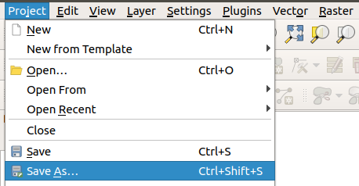
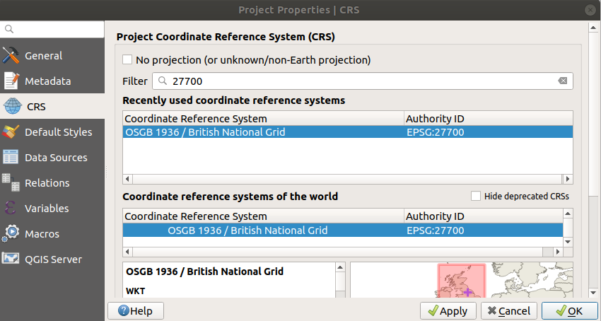

# Working with QGIS

```{r, include=FALSE}
knitr::opts_chunk$set(echo = FALSE, out.width = "100%")
```

Before importing data (covered in Chapter \@ref(data)) it is worth getting to know QGIS, in terms of its main components, how to get help, and how it helps you organise your work into projects.
This chapter describes some of QGIS's key elements.  

## Opening QGIS

Probably the quickest way to open QGIS on your computer press 'Windows button' on your keyboard and type 'qgis' (see Figure \@ref(fig:qgis-start)).

<!-- \begin{wrapfigure}{R}   -->
<!--  \begin{center} -->

```{r qgis-start, fig.cap="Starting QGIS", out.width="50%"}
# Idea: wrapfigure: https://stackoverflow.com/questions/44845699/
knitr::include_graphics("figures/qgis-start.jpg")
```

<!-- \end{center} -->
<!-- \end{wrapfigure} -->

Select 'QGIS Desktop' from the list.
If you have multiple versions, choose the latest version.
You should see a new window appear that contains the main features of the QGIS program (see Figure \@ref(fig:qgis-window)).

## Key QGIS components

These include the following main components, numbered from 1:5 in the figure and the bullet points below (source: adapted from the [QGIS Manual](https://docs.qgis.org/2.18/en/docs/user_manual/)):

1. Menu Bar: like most GUI-based programs you can control key aspects of QGIS and execute key commands, like saving your project and loading new datasets, by clicking Project or Layer.  Note: shortcuts to access these menus from the keyboard are `Alt+J` and `Alt+L`, respectively.
1. Toolbars: these are small icons located towards the top and left-hand side of Figure \@ref(fig:qgis-window). In addition to options available from the Menu Bar, these icons provide tools for interacting with the map such as Pan (the hand symbol) and Zoom (the + and - signs).
1. Panels: Panels are interactive elements that show information on particular aspects of the project. A view of files in the Browser Panel and the Layers Panel are shown in Figure \@ref(fig:qgis-window). 
1. Map View: this is where the geographic data is displayed in an interactive map for interactive visualisation.
1. Status Bar: this small but important element at the bottom of QGIS shows details about the current status of the Map View, such as the Coordinate Reference System (CRS), in this case, EPSG:3857 and scale.

NB. GUI stands for Graphical User Interface. Any programme which wou interact with using menus and buttons has a GUI.  Examples are Excel and QGIS.  

```{r qgis-window, fig.cap="QGIS main user interface features", out.width="100%"}
knitr::include_graphics("figures/QGISGUI.jpg")
```


## QGIS projects

Projects are the way that QGIS saves your work.
Make sure you save your QGIS work in projects.
To do this, click on the Project menu and select Save (or Save As), as shown in Figure \@ref(fig:project-open-menu) and select a folder that will contain your project.
Give your project a sensible name, like 'learning-qgis'.

```{r project-open-menu, echo=FALSE, fig.cap="The project menu", out.width="50%"}

```


Projects don't contain any data themselves but do contain information such as the current map view, links to data, and instructions on how data should be presented. Projects are an easy way to keep your work organised and allows you to stop and come back to work at a later date.  They also allow you to set the co-ordinate reference system.  

## Setting a coordinate reference system (CRS)

To set a coordinate system click on Project > Properties (or use the shortcut Ctrl + Shift + P)

The box shown in Figure \@ref(fig:projectsetup) should appear.
This allows you to **set up the CRS to 27700**.

```{r projectsetup, fig.cap="Project menu, project properties, set Coordinate ReferenceSystsm 27700", out.width="80%"}

```

Type 27700 into the Filter box. 27700 refers to the "OSGB 1936 British National Grid". This is a projected coordinate system for the UK.  (there is a brief explanation of co-ordinate systems in Chapter 1).

**Click apply ** before clicking OK. 
If it has worked the bottom right of your screen will say "EPSG:27700"


Save the project and give it a suitable name such as "QGIS_Intro"


You can create, load, save and 'save as' projects using the buttons shown in Figure \@ref(fig:projectbuttons) or using the options in the Project menu. QGIS project files have the extension.qgz


```{r projectbuttons, fig.cap="New Project, Open Project, Save Project, Save Project As buttons", out.width="30%"}
knitr::include_graphics("figures/project_buttons.JPG")
```

A common GIS mistake is to send someone a project file and expect that they can look at your maps and data. But, this does not work, because project files do not contain data.  
If you want to send someone a QGIS project to work on or look at, then you need to send them the project file and any data which you have loaded into the project.  (We will show how to load data in the next chapter).  


## Panning and Zooming

You can naviagate around the map using the mouse or the buttons in the toolbar.

```{r navigation, fig.cap="Navigation buttons: Pan Map, Pan to Selection, Zoom In, Zoom Out, Zoom to Native Resolution, Zoom Full, Zoom to Selection", out.width="50%"}
knitr::include_graphics("figures/navigation.jpg")
```


## Summary 

This section introduced QGIS and its main components.
Before moving on to the next section, in which we will import data into QGIS, ensure that you have:

1. Opened QGIS and created and named a project, setting the coordinate reference system and saving it in an appropriate place on your computer.


