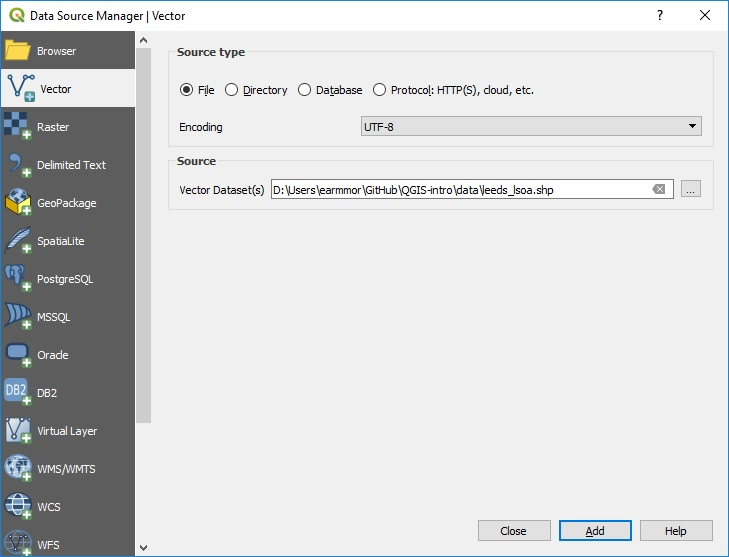
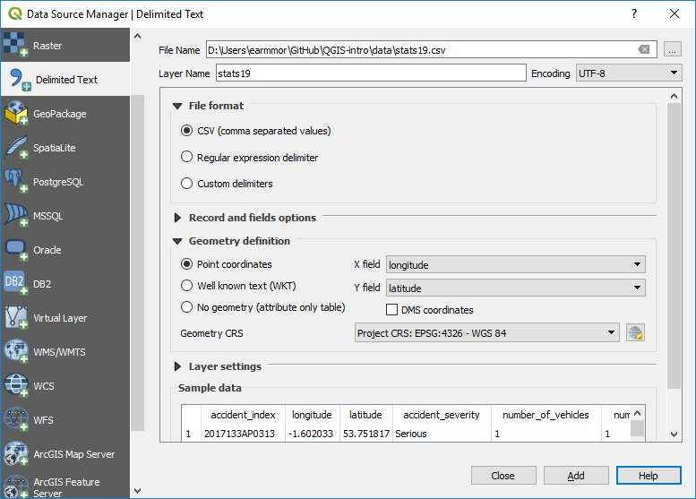

# Downloading and loading data {#data}

A vital skill for doing using GIS skills to solve real-world problems is finding, downloading and importing data.

Often, the first stage in the data downloading/loading process is to find the data online. 
In this case, we will access data from the following site, which contains data we prepared earlier for the course: [github.com/ITSLeeds/QGIS-into/releases](https://github.com/ITSLeeds/QGIS-intro/releases/tag/0.01).

```{r, echo=FALSE}
if(!dir.exists("QGISforSSPAdata/")) {
  #u = "https://github.com/ITSLeeds/SSPA/releases/download/v1.1/QGISforSSPAdata.zip" #old data
  u = "https://github.com/ITSLeeds/QGIS-intro/releases/download/0.01/data.zip" #new data
  download.file(u, "QGISforSSPAdata.zip")
  unzip("QGISforSSPAdata.zip")
}
```

Download and unzip the data.zip file. This file contains the data that you will use for the rest of the tutorial.

Before opening data files, you should first have created a QGIS project, covered in the previous chapter.


## Importing spatial data

To load a spatial data file, click on the Data Source Manager button in the top left corner of QGIS (see Figure \@ref(fig:data-source-manager)).

```{r data-source-manager, out.width="10%", fig.cap="The Data Source Manager icon", echo=FALSE}

```

We will use the leeds_lsoa.shp example file to plot the boundaries of the Lower Layer Super Output Areas in Leeds.

Open the Data Source Manager and select “Vector” then specify the “File Name” and location, or use the … to navigate to the file.

Click “Add” then “Close”. Note the data manager does not close automatically after adding a file to your project, this is to allow you to add multiple files at once.

```{r data-source-manager-shp, out.width="100%", fig.cap="The Data Source Manager - Vector", echo=FALSE, fig.show='hold'}

```

The result should look something like the map displayed in Figure \@ref(fig:imported).

```{r imported, fig.cap="The map after the file 'leeds_lsoa.shp' has been imported."}
knitr::include_graphics("https://user-images.githubusercontent.com/1825120/53740479-2f372f00-3e8c-11e9-8add-a163b104037b.png")
```


## Importing a CSV or text file

### CSV with spatial data

Sometimes you have data that contains spatial information but is not in a spatial data format.  A common example is to have a CSV file with latitude and longitude columns. CSV is a common format for storing data and can be opened by lots of different software, including Microsoft Excel. 
We will use the stats19.csv example file to plot the location of vehicles collisions in Leeds.

Open the Data Source Manager and select “Delimited Text” then specify the “File Name” and location, or use the … to navigate to the file.
Under the “Geometry definition” select “Point coordinates” and set the “X field” to “longitude” and the “Y field” to “latitude”.  Set the “Geometry CRS” to “EPSG: 4326 – WGS 84”.

Click “Add” then “Close”.

```{r data-source-manager-csv, out.width="100%", fig.cap="The Data Source Manager - Delimited Text", echo=FALSE}

```

After importing the 'stats19' data, using menus shown in Figure \@ref(fig:data-source-manager-csv), you should see points on the map, representing where crashes in Leeds took place in 2017.
If you do not see dots on the map, re-read this section.
If you do, congratuations!

### CSV without spatial data

QGIS will also allow you to import non-spatial data.
Import the population.csv example file for later use using the same process as above, but selecting “No geometry (attribute only table)”.
When you have added this layer, and the others, the items in the Layer panel in the left of QGIS should look like this:

```{r layers, fig.cap="The imported data layers shown in the Layer window.", out.width="50%"}
knitr::include_graphics("https://user-images.githubusercontent.com/1825120/53741128-95708180-3e8d-11e9-8070-38a030de2fa2.png")
```


## Summary

Before moving on to the next chapter make sure you have.

1. Downloaded the example data
1. Imported the three files to QGIS

Bonus Exercises

1. Read about the disadvantages of shapefile at some of the alteratives http://switchfromshapefile.org/ 

