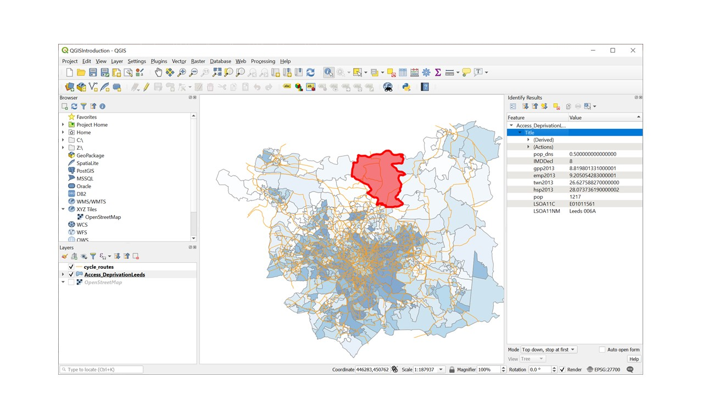
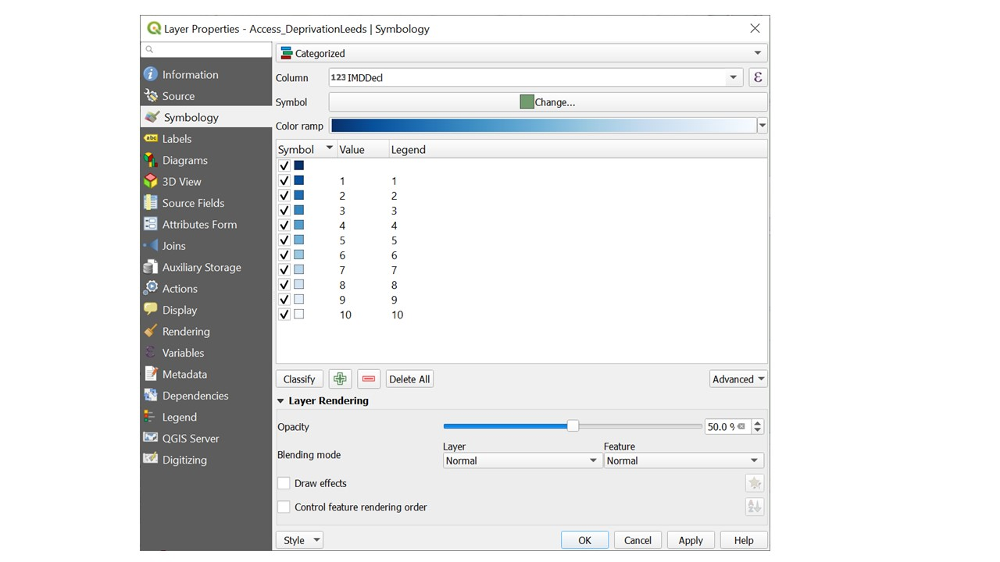

# Style and select features

## Identify Features

You now have several layers on your map.  You can turn layers on and off by clicking the tick box to the left of the layer in the layer tab.  You can also change the order of layers by dragging layers up and down the layer panel.  

1. In the layers panel, Single left click where it says "Acess_deprivationLeeds". This will allow us to identify features from that layer.   

1. Press the  'Identify features button'/. It allows you to interrogate features on the map by clicking on them (see Figure \@ref(fig:identify)). 

```{r identify, out.width="10%", fig.cap="Identify Features Button", echo=FALSE}
knitr::include_graphics("figures/identify.jpg")
```

3. Clicking on a map feature brings up a panel with more information about that feature.
(see Figure \@ref(fig:identify-panel)).


The names which appear in the panel might not make sense.  It is good practice when creating GIS data to make a note of what each column name means, where the data comes from and provide ‘metadata’.  


This list of "basic metadata" tells you what each column of data is (data columns also get called data fields).  

* Access_DeprivationLeeds 
* LSOA11C LSOA code
* emp2013 =  travel time (minutes) to nearest employment centre
* gpp2013 = travel time (minutes) to nearest doctor 2013
* hsp2013 = travel time (minutes) to nearest hospital 2013
* twn2013 = travel time (minutes) to nearest town centre 2013
* IMDDecl = Index of multiple Deprivation decile 
* pop = population 
* pop_dens = population density per hectare


```{r identify-panel, out.width="100%", fig.cap="Identify Features Pannel", echo=FALSE}

```

## The Attribute Table

As well as mapping shapes, QGIS stores information about each feature called “attributes” in an attribute table. 

1.  To open the attribute table, Go to the layer panel and right click on the layer AccessvsDep_Leeds layer
1.  Click "open attribute table".  

The attribute table looks rather like a spreadsheet, the columns (data fields) are labeled as per the metadata above.  


## Symbology
So far you have loaded layers to show the shapes and locations of features.  You can also change the appearance of layers to communicate additional information about the attributes of particular features in particular places. This is called symbology.


**Setting symbology, colour and transparency of a polygon layer**


1.	Double click on the Access_DeprivationLeeds  layer, the ‘Layer properties’ dialog box appears
We are going to display deprivation deciles as categories.  
1. Click on 'Symbology' on the left hand side of the layer properties box
1.	Click the dropdown menu where it says 'single symbol'.  Select 'categorised' from the classification drop down menu shown below because the deciles are Ordinal data.  (You would choose 'Graduated' if you were visualising a continuous variable such as population density)
1. Select 'IMDDecl' from the column drop down list.
1. Select 'Blues' from the Color Ramp drop down list
1. Press the 'Classify' button
1. Press the Colour ramp dropdown list again.  This time select 'invert colour ramp' (1 is most deprived 10 is least deprived)
1. Click the 'Layer Rendering' arrow and Set the opacity slider to 50%.  
1. Click  apply and then OK.  


```{r polygonSymbology, out.width="100%", fig.cap="Setting the symbology of a polygon layer", echo=FALSE}

```


**Setting symbology of a line layer with a single symbol** 

Double click on the layer name, select symbology and experiment with the line colour and thickness to get something that shows up well.  


**Setting symbology of a point layer**

Another way to open the layer properties dialog box is as follows:  

1. In the layers panel right click on "stats19" and select "properties", in the menu on the left select "Symbology"


```{r symbology-menu, out.width="100%", fig.cap="Symbology Menu used to categorise a point layer", echo=FALSE}
knitr::include_graphics("figures/symbology.png")
```


2. For the type of Symbology select "Categorised", the column "accident_severity", then chose a colour ramp from the drop-down menu. Then click "Classify". This will add all the different possible values from the data and assign each a unique colour. Click OK to return to the map.

```{r symbology-results, out.width="100%", fig.cap="Road collisons categoried by severity", echo=FALSE}
knitr::include_graphics("figures/symbology_results.png")
```


3. Finally Using the opacity slider (in the symbology dialog box) and re-ordering the layers (by dragging them in the layer panel), arrange the mulitple layers clearly.  You may also want to zoom in or our a little to ensure you can see all the map features.  

**Be sure to save your work regularly**

## Summary

Before moving onto the next chapter make sure you have.

1. set the symbology of the points lines and polygon data.  
1. Saved your work

**Bonus Exercises**

1. Experiment using different columns and types of symbology

Hint: Think about how different types of symbology are appropriate to different types of data (categorical, discreet, continuous). Can you discover any interesting patterns in the data? 
when plotting a continuous variable e.g. population density, experimnet setting the mode
as 'Equal Interval, 'Quantile' and 'Natural Breaks'.  How does your choice of breakpoints affect the presentation of the data?

