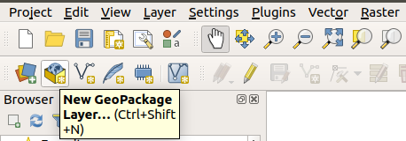
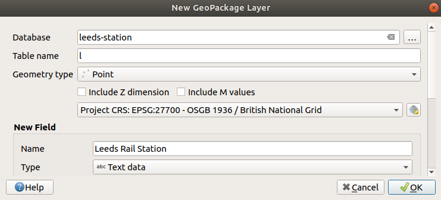
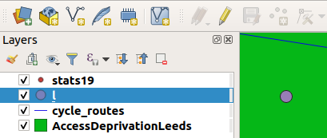

# Create and edit (transport) data

Sometimes it is useful to create your own geographic data, for example to represent new transport infrastructure.
This short chapter, based on Section [6.1](https://docs.qgis.org/2.8/en/docs/training_manual/create_vector_data/create_new_vector.html) in the QGIS manual, demonstrates how to create a new layer.
In it we will create an object representing Leeds Rail Station.

First, ensure that the Digitising Toolbar is enabled (click on View| Toolbars | Digitizing if it is not).
You should see buttons like those shown in Figure \@ref(fig:new-geopackage).

```{r new-geopackage, echo=FALSE, fig.cap="Selecting a new GeoPackage layer from QGIS's top ribbon menu."}

```

Click on "New GeoPackage Layer" and you should see another box.
Fill the fields in the box according to the text shown in Figure \@ref(fig:new-geopackage-box) (note we're creating a layer with geometry type Point) and click OK to create the layer.

```{r new-geopackage-box, echo=FALSE, fig.cap="Popup box to add new GeoPackage layer, with text added for Leeds Rail Station."}

```

Next, click the pencil icon (see \@ref(fig:new-geopackage) below the Plugins menu) and then click on the Add Point Feature just to the right of the pencil.
When you have placed the point somewhere, click on the pencil to stop editing and save the resulting layer.
It should something like that shown in Figure \@ref(fig:leeds-station).
Not impressed with how the map looks?
Do not worry.
Styling features is the topic of the next chapter!

```{r leeds-station, echo=FALSE, fig.cap="Screenshot of the map after a new layer has been added."}

```

```{block2, type='rmdnote'}
For a more detailed tutorial on adding and editing data with QGIS, see [Chapter 6 of the QGIS training manual](https://docs.qgis.org/2.8/en/docs/training_manual/create_vector_data/index.html).
```
