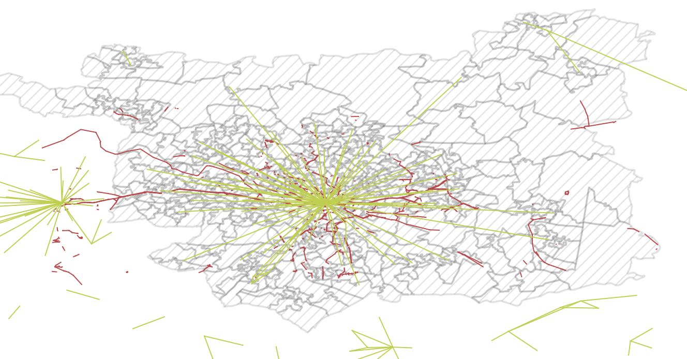
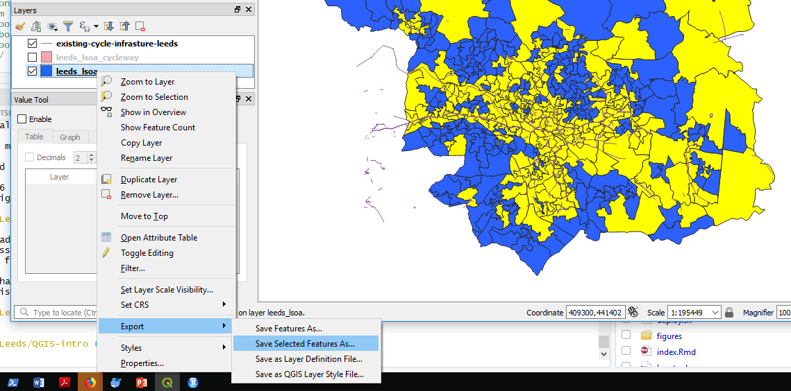
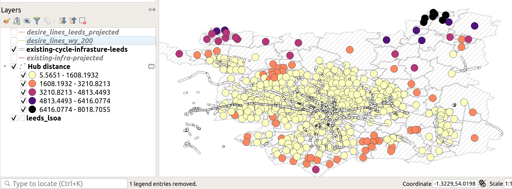
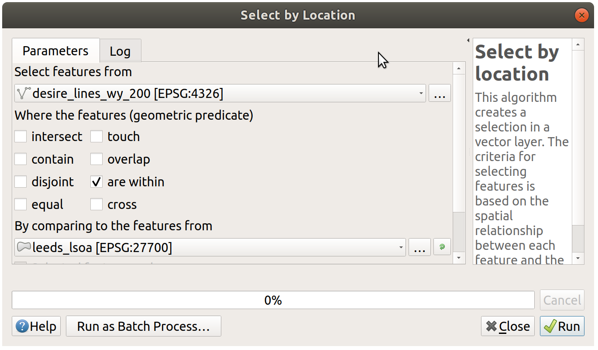
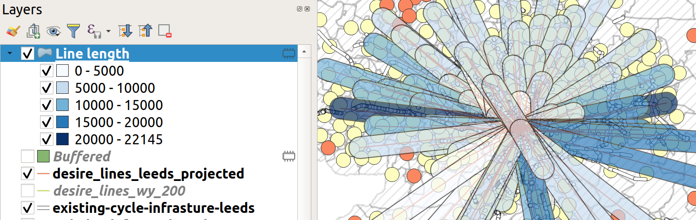
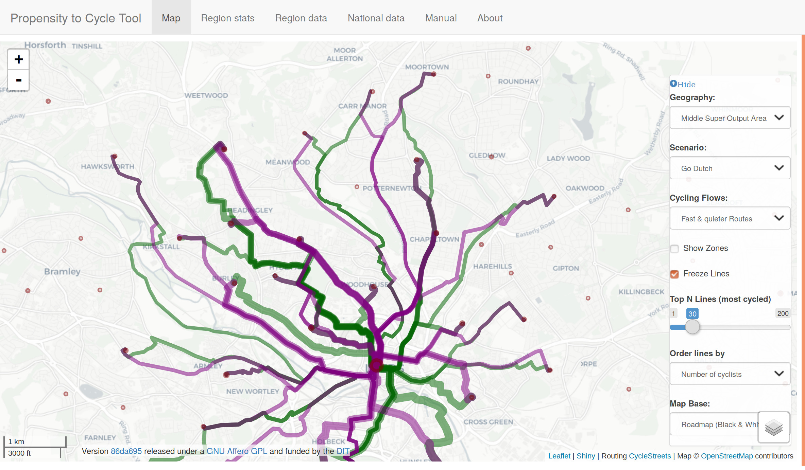

# Accessibility analysis

Accessibility is a crucial concept in transport planning.
One of the key aims of many transport policies is to make places more accessible to people, whether that's shops, schools or hospitals.
But what does that mean?

In this example, we will use QGIS to explore accessibility to cycle infrastructure.
Although this is an unusual measure of accessibility, the methods can be modified and extended to explore other types of accessibility, for example, accessibility to schools before and after 'school agglomeration', the topic of an academic paper based on a case study in Sao Paulo, Brazil [@moreno-monroy_public_2017].

## Input data

Building on previous chapters, we will use a case study of Leeds.
There are two additional datasets we'll use for this, saved in the file `data_accessibility.zip` in the releases section of the tutorial.

The input datasets were taken from 2 places:

- The cycle infrastructure data was taken from the Cycling Infrastructure Prioritisation Tool ([CyIPT](https://www.cyipt.bike))
- The desire lines data were taken from the propensity to cycle tool (see [pct.bike/m/?r=west-yorkshire](http://www.pct.bike/m/?r=west-yorkshire)) [@lovelace_propensity_2017].

Following the guidance in previous chapters, we *pre-processed* these datasets in 2 ways:

- Reproject the datasets, so they are in the British National Grid CRS (EPSG:27700)
- Subset the desire lines so that we only have the top 200 across West Yorkshire

Download and unzip the `data_accessibility.zip` file and load the `.gpkg` files.
As a taster of what we will do, and to check you have the correct input data, the results should look something like the map shown in Figure \@ref(fig:accesso).

```{r accesso, fig.cap="Overview of input data for this chapter."}

```


## Identify areas in Leeds with some cycle infrastructure

A simple but effective way of comparing two geographic layers, as the first step towards an accessibility indicator, is a spatial selection.
We can do this to identify zones that have access to *at least some cycle infrastructure*:

- Use the Select by location tool to select only those LSOAs with at least some cycleways in
- Do this with the following menu options: Vector > Research Tools > Select by Location
- Save the result as a new layer called, for example, `leeds_lsoa_cycleway`

The result should look like that shown in Figure \@ref(fig:select-by-location).

```{r select-by-location, fig.cap="Select by Location: results."}

```

- What proportion of zones have at least some cycle infrastructure, according to this measure?
- What are the limitations of this approach? 
  - List at least 2.
  
<!-- There is no measure of how *much* cycle infrastructure is in each zone. -->
<!-- There is no measure of the quality of the infrastructure. -->
<!-- It does not account for whether the infrastructure goes where people want to go. -->

## Calculate distances to cycle infrastructure

A slightly more sophisticated measure of accessibility is Euclidean distance.
Rather than testing whether or not zones contain cycling infrastructure, resulting in a *binary variable*, `TRUE` or `FALSE`, this simple distance calculation results in a *continuous variable* in units of metres.

To calculate this metric, we will use the 'Distance to nearest hub' algorithm in QGIS.
To run this algorithm:

- Open the Processing Toolbox, e.g. by clicking 'Processing' from the menu bar and selecting 'Toolbox' (pro tip: this can be achieved more quickly by pressing Alt-C and then T to get to the menu without touching the mouse)
- Search for and select 'Distance from the nearest hub (points)' in the Processing Toolbox (see Figure \@ref(fig:processing-hub-distance), left)
- Select `leeds_lsoa` as the Source points layer and the `existing-cycle-infrastructure` as Destination layer in the popup window (see Figure \@ref(fig:processing-hub-distance), left)


```{r processing-hub-distance, fig.cap="Distance to nearest hub algorithm selection (left) and input parameters in the resulting popup (right).", fig.show='hold', out.width="49%"}
knitr::include_graphics(c(
  "figures/processing-hub-distance.png",
  "figures/distance-processing.png"
  ))
```

The result is a new point layer, with one point per LSOA zone.
Style this new layer based on the Hub distance field it contains and give it an appropriate colour scheme.
It should look something like Figure \@ref(fig:hub-distance-centroids).

```{r hub-distance-centroids, fig.cap="Demonstration of hub distance calculation"}

```

- Is the distribution of distances to cycle infrastructure as you would expect? Why?
- List at least two disadvantages of this new accessibility measure and two ways you could improve it using your evolving QGIS skills.
- Bonus: Use a spatial join to merge the 'Hub distance' variable in the new point layer back onto the LSOA zone layer.

## Calculate cycle infrastructure provision along desire lines

The accessibility measures we have calculated have been for zones.
These static entities are the basis of many local statistics on their resident populations (inhabitants), but they tell us little about travel patterns.
A more appropriate level of geographic analysis for transport planning is ofter the desire line, one-way trips between an origin and a destination [@lovelace_geocomputation_2019, Chapter 12].
Such desire lines are represented in the desire line object, loaded in Section \@ref(input-data), which were generated for the Propensity to Cycle Tool project (see [www.pct.bike](http://www.pct.bike/)).

Although the desire lines represent travel, they clearly are not the routes that people take from home to work (the dataset comes from the 2011 Census question on travel to work).
People do not travel in straight lines; only birds can do that (hence the phrase 'as the crow flies' to denote straight line distance).
People take a range of routes from A to B.
Therefore, the distance of cycleway *inside a buffer surrounding a desire line* may be a better indication of the accessibility of cycle infrastructure for everyday travel than the previous measures.

The first step is to subset the desire lines so that only those *within* the Leeds LSOA object are included.
You can do this as follows:

- Again, select the Select by location tool, as you did previously to select the LSOA zones that had some cycle infrastructure.
- This time select features in the desire lines that are *Within* the zones.
- Bonus: what is the difference when you select different types of geometric predicates (see Figure \@ref(fig:geometric-predicate))?

```{r geometric-predicate, fig.cap="Select by location popup, to subset only desire lines within Leeds"}

```


After you have saved a subset of the desire lines, it's time to calculate buffers. You will create buffers of 500m (feel free to experiment with different buffer sizes after you have generated the desired result).
Your growing knowledge of QGIS (and ability to search for help online if you get stuck) should help you do the next step without detailed instructions (hint: it's also found in the Vector menu).

The final step in the process is to calculate the length of cycle infrastructure in each buffer.
Again, you must look this up (hint: the algorithm is called 'Sum line lengths').
After running this algorithm on the correct inputs, and colouring the result according to the length of infrastructure in each polygon, the map should resemble Figure \@ref(fig:buffered-lines).

```{r buffered-lines, fig.cap="Buffered lines, coloured by the length of infrastructure within each one."}

```

- Given what you know about Leeds, are these the desire lines you'd expect to be well-served by cycle infrastructure?
- Explore the data in the Propensity to Cycle Tool (PCT) for Leeds and decide where you think new infrastructure could go (see [www.pct.bike/m/?r=west-yorkshire](http://www.pct.bike/m/?r=west-yorkshire) and Figure \@ref(fig:pct-west)).
- What additional steps could you take with QGIS to improve the accessibility metric shown in Figure \@ref(fig:buffered-lines)?

**The next tasks are bonus extras. Select one of the following (or more if you are fast!):**

- Bonus 1: Download the fast and quiet route data from the PCT's Region Data tab and load it into QGIS (see the top of Figure \@ref(fig:pct-west) for the Region data tab).

- Bonus 2: is there a positive correlation between cycling levels and the length of cycle infrastructure in the buffer of each desire line?

- Bonus 3: explore and download the PCT data for schools [here](http://npct0.vs.mythic-beasts.com/). With reference to an academic paper on the subject [@goodman_scenarios_2019], how could you use the data to generate a 'Sustainable Travel to School Accessibility Measure' (STSAM)?

```{r pct-west, fig.cap="The propensity to cycle tool (PCT), showing data for fast and quiet routes, and demonstrating the Region dat' tab. Go to www.pct.bike to explore the data."}

```


## Plugins

An important aspect of open source software is the wider community, which often supports a diverse range of extensions which add features to the original program.
QGIS is no exception: it has a thriving community of programmers who, together, have created dozens of 'plugins', which enhance QGIS's capabilities in countless ways.
At the time of writing, there are 200+ plugins available for QGIS 3, and this number is continuously rising.

To install a plugin, click on Plugins in the Menu Bar (or press `Alt+P`).
You should see the following options.
Select the second option (Manage and Install Plugins, see Figure \@ref(fig:plugins) (left)).
You should see a new window, like the one displayed in Figure \@ref(fig:plugins) (right).


```{r plugins, fig.cap="Plugins menu (left) and the resulting window (right).", fig.show='hold', out.width="50%"}
knitr::include_graphics(c(
  "figures/plugins-menu.png",
  "figures/plugins-window.png"
))
```

To install a plugin, click on the 'Install plugin' button in the bottom right corner of Figure \@ref(fig:plugins) (right).
Use the search bar to explore for plugins. What happens if you search for 'trans', for example (short for transport)?

**Exercise: install the QuickMapServices plugin and use it to put a basemap showing Leeds in the Map View.**
Hint: after you have installed the plugin navigate to the Web menu (or press `Alt+W`).
<!-- After completing the exercise, your QGIS session should look something like that displayed in Figure \@ref(fig:webmap). -->


## Advanced exercises (optional)

1. Install the ORS Tools Plugin
1. Signup for an API token at openrouteservice.org
1. Add token to ORS Tools Settings
1. Download the locations of schools from https://overpass-turbo.eu/
1. Buffer schools and find population within 1km of a school
1. Make isochrone for 10, 20, 30 min cycle from schools
1. Dissolve isochrone together
1. may need to change rendering order (properties -> symbology -> layer rendering)
1. use geoprocessing v.clean (with clean type break)
1. edit polygons to remove the unneeded sections
1. join the isochrones onto the points


## Summary

This chapter involved downloading and importing more data related to travel behaviour and cycle infrastructure.
Three simple of indices of accessibility to cycle infrastructure were developed:

- Whether any cycle infrastructure was provided
- Distance from zone centroids to the nearest cycleway
- Length of cycle infrastructure within a given buffer distance of desire lines

The skills could be used to measure accessibility to different services, including schools, shops and healthcare.
