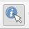
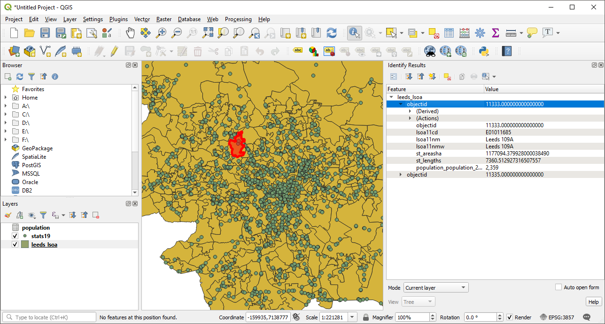
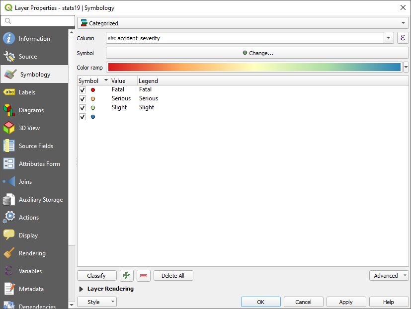
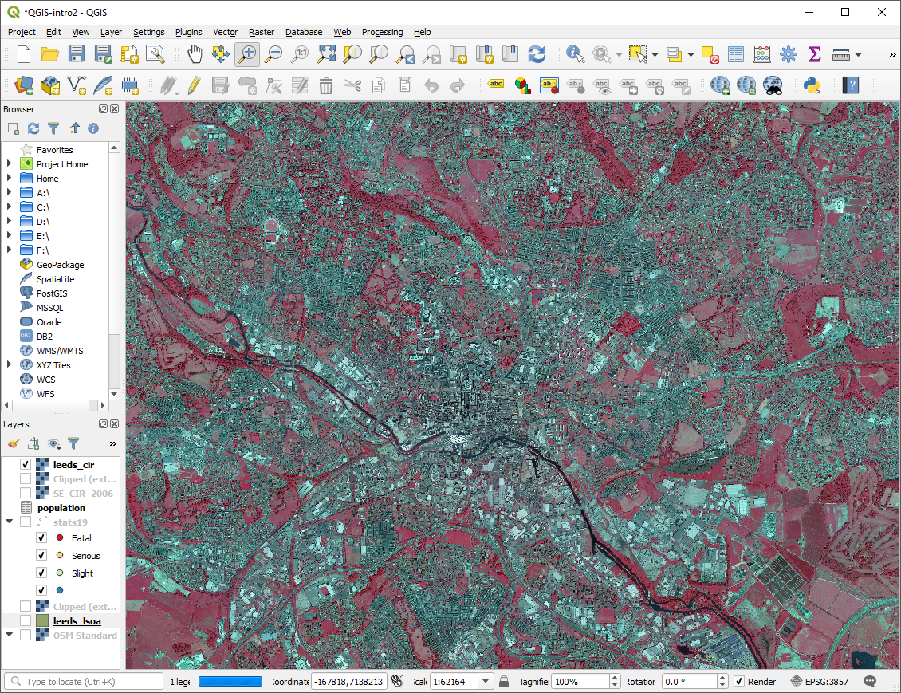
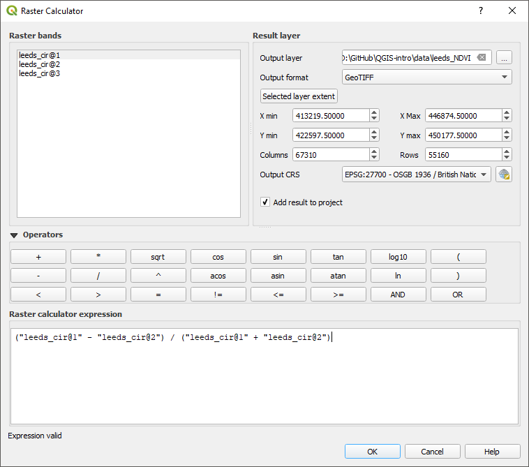
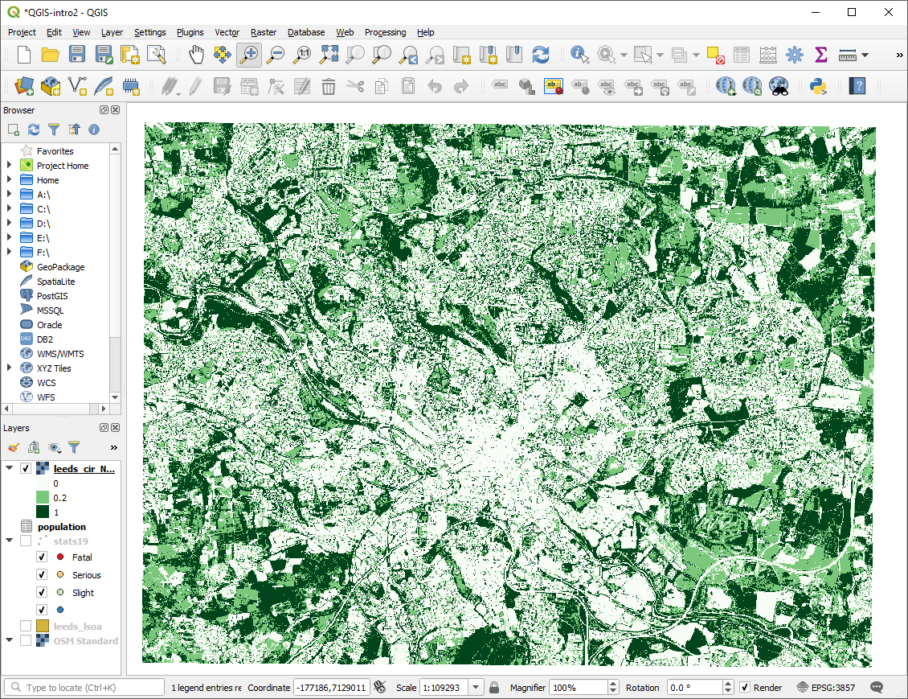
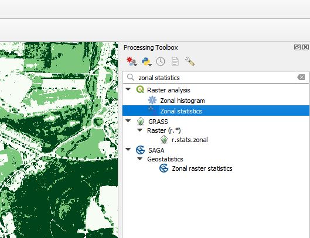
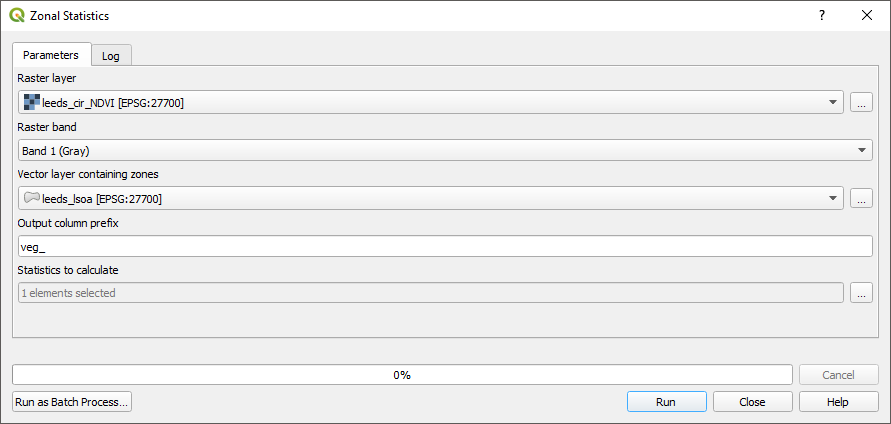
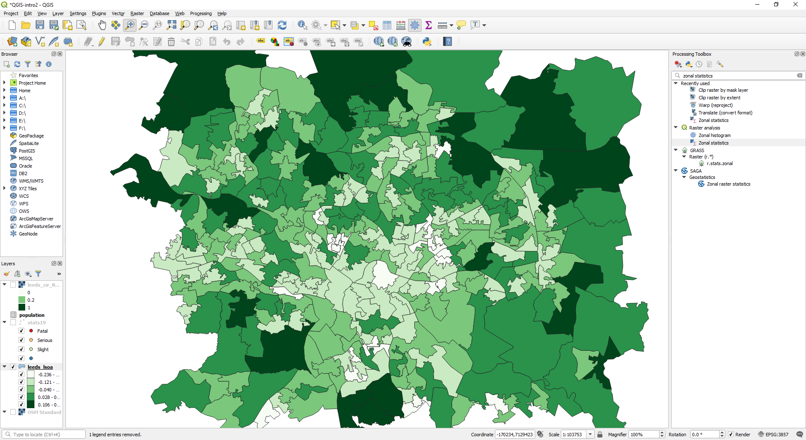

--- 
title: "QGIS for Transport Research: an introduction"
author: "Robin Lovelace and Malcolm Morgan"
date: "2019-03-11"
papersize: a4
fontsize: 12pt
site: bookdown::bookdown_site
description: "A book on using open source Geographic Information System for transport planning."
github-repo: ITSLeeds/QGIS-intro
graphics: yes
#cover-image: images/cover.jpg
bibliography: [book.bib, packages.bib]
---

<!-- For CRC Press format: -->
<!-- documentclass: krantz -->
<!-- biblio-style: apalike -->
<!-- link-citations: yes -->
<!-- colorlinks: yes -->
<!-- lot: yes -->
<!-- lof: yes -->
<!-- fontsize: 13pt -->


# Preface {-}

Transport is inherently geographic. All transport involves movement from a place on the Earth to another. This means that Geographic Information Systems (GIS) have great potential to assist transport researchers. QGIS is a powerful GIS package that has become popular worldwide due to its wide range of features (including via hundreds of community contributed plugins), intuitive interface, and accessibility. QGIS is free and open source, meaning that anyone can download, install and even contribute to it. 

The growing popularity, power and features of QGIS means that **learning it now** could save much time and money long into the future: **QGIS is futureproof**.
A more mundane reason for writing this tutorial was the installation of **QGIS 3** across the University of Leeds.
Suddenly existing material, developed for **QGIS 2**, no longer worked.
Instead of incrementally updating those materials we decided to start from a blank slate, allowing the inclusion of new datasets and links to excellent online content that already exists for QGIS.

The aim is to get you up-to-speed with *the most important concepts and techniques* in QGIS for *Transport Planning*.
We refer to Transport Planning in the broad sense of providing evidence-based guidance to support sustainable transport behaviours.
With air pollution, the obesity crisis, and growing levels of economic inequality in cities worldwide, this inevitably means investment in walking, cycling and public transport.
For this reason, the data used in this booklet focusses on these modes. 


## Pre-requisites {-}

This course assumes that you have access to a working installation of QGIS 3 and an internet connection.
We will explain how to download the data needed for the practicals in Chapter \@ref(data).

<!-- ## Structure of the book {-} -->

<!-- Chapters \@ref(introduction) introduces GIS and the program QGIS... -->

<!-- ## Software information and conventions {-} -->

<!-- I used the **knitr**\index{knitr} package [@xie2015] and the **bookdown**\index{bookdown} package [@R-bookdown] to compile my book. My R session information is shown below: -->

<!-- ```{r} -->
<!-- xfun::session_info() -->
<!-- ``` -->

<!-- Package names are in bold text (e.g., **rmarkdown**), and inline code and filenames are formatted in a typewriter font (e.g., `knitr::knit('foo.Rmd')`). Function names are followed by parentheses (e.g., `bookdown::render_book()`). -->

<!-- ## Acknowledgments {-} -->

<!-- A lot of people helped me when I was writing the book. -->

<!-- ```{block2, type='flushright', html.tag='p'} -->
<!-- Frida Gomam   -->
<!-- on the Mars -->
<!-- ``` -->


<!--chapter:end:index.Rmd-->

\mainmatter


# Introduction

## What is GIS?

GIS stands for Geographic Information Systems.
The term was first used in the 1960s and has since become a common way of referring to the analysis of geographic data.

That raises another question: what do we mean by 'geographic data'?
The defining feature of geographic data is that it has coordinates that allow the position of records in the dataset to be located on Earth.
There are two main types of geographic data:

1. Vector data, which typically represent points, lines and polygons. An example is a series of points representing a road.
2. Raster data, which typically represent a continuously changing surface, such as height.
An example is a satellite image of a road.

The difference between vector and raster data types is illustrated in the figure below, which shows the same road (Woodhouse Lane in Leeds) represented in vector and raster geographic data forms.


Since graphical user interfaces (GUIs) for GIS became popular in the early 2000s, the word GIS has become almost synonymous with 'Dedicated GIS software'.
Examples of dedicated GIS software include the open source GIS software QGIS (we will come onto what QGIS is in a subsequent section) and proprietary software such as ArcMap and TransCAD.
It is also possible, and increasingly popular, to do GIS using a programming language with a command-line interface (CLI) such as Python or R (see \@ref(next-steps))

<!-- ## Why use GIS for transport research? -->

## What is QGIS?

QGIS is an open source dedicated GIS software program.
It has become the most commonly used open source program for working with geographic data.
Search engine data from Google shows that QGIS is becoming increasing popular.
QGIS is ideal not only for learning GIS techniques but also using them in practice where software licensing and cost may be important. 
Figure \@ref(fig:trends) shows how QGIS's popularity over time compares with the GIS product ESRI **ArcMap** and the transport planning product, PTV **Visum**.^[
QGIS does not have dedicate transport planning functionality like Visum
]

<div class="figure">

<p class="caption">(\#fig:trends)The growing popularity of QGIS, as measured by internet search traffic. Source: [trends.google.com](https://trends.google.com/trends/explore?date=all&q=qgis,arcmap,visum).</p>
</div>

<!-- ## Alternatives to QGIS -->

<!--chapter:end:01-introduction.Rmd-->

# Working with QGIS


Before importing data (covered in Chapter \@ref(data)) it is worth getting to know QGIS, in terms of its main components, how to get help, and how it helps you organise your work into projects.
This chapter describes some of QGIS's key elements and 

## Opening QGIS

Probably the quickest way to open QGIS on your computer press 'Windows button' on your keyboard and type 'qgis' (see Figure \@ref(fig:qgis-start)).

<!-- \begin{wrapfigure}{R}   -->
<!--  \begin{center} -->

<div class="figure">

<p class="caption">(\#fig:qgis-start)Starting QGIS</p>
</div>

<!-- \end{center} -->
<!-- \end{wrapfigure} -->

Select 'QGIS Desktop' from the list.
If you have multiple versions, choose the latest version.
You should see a new window appear that contains the main features of the QGIS program (see Figure \@ref(fig:qgis-window)).

## Key QGIS components

These include the following main components, numbered from 1:5 in the figure and the bullet points below (source: the [QGIS Manual](https://docs.qgis.org/2.18/en/docs/user_manual/)):

1. Menu Bar: like most GUI-based programs you can control key aspects of QGIS and execute key commands, like saving your project and loading new datasets, by clicking Project or Layer.  Note: shortcuts to access these menus from the keyboard are `Alt+J` and `Alt+L`, respectively.
1. Toolbars: these are small icons located towards the top and left-hand side of Figure \@ref(fig:qgis-window). In addition to options available from the Menu Bar, these icons provide tools for interacting with the map such as Pan (the hand symbol) and Zoom (the + and - signs).
1. Panels: Panels are interactive elements that show information on particular aspects of the project. A view of files in the Browser Panel and the Layers Panel are shown in Figure \@ref(fig:qgis-window). 
1. Map View: this is where the geographic data is displayed in an interactive map for interactive visualisation.
1. Status Bar: this small but important element at the bottom of QGIS shows details about the current status of the Map View, such as the Coordinate Reference System (CRS), in this case, EPSG:3857 and scale.

<div class="figure">

<p class="caption">(\#fig:qgis-window)QGIS main user interface features</p>
</div>

## Plugins

An important aspect of open source software is the wider community, which often supports a diverse range of extensions which add features to the original program.
QGIS is no exception: it has a thriving community of programmers who, together, have created dozens of 'plugins', which enhance QGIS's capabilities in countless ways.
At the time of writing, there are 200+ plugins available for QGIS 3, and this number is continuously rising.

To install a plugin, click on Plugins in the Menu Bar (or press `Alt+P`).
You should see the following options.
Select the second option (Manage and Install Plugins, see Figure \@ref(fig:plugins) (left)).
You should see a new window, like the one displayed in Figure \@ref(fig:plugins) (right).


<div class="figure">

<p class="caption">(\#fig:plugins)Plugins menu (left) and the resulting window (right).</p>
</div>

To install a plugin, click on the 'Install plugin' button in the bottom right corner of Figure \@ref(fig:plugins) (right).
Use the search bar to explore for plugins. What happens if you search for 'trans', for example (short for transport)?

**Exercise: install the QuickMapServices plugin and use it to put a basemap showing Leeds in the Map View.**
Hint: after you have installed the plugin navigate to the Web menu (or press `Alt+W`).
After completing the exercise your QGIS session should look something like that displayed in Figure \@ref(fig:webmap).

## Loading basemaps

You can add a basemap by clicking on the 'XYZ Tiles' option in the Browser Panel. Options should include Google and OpenStreetMap.
Clicking on one of these will add a new layer, which can be seen in the Layers menu.

Another way to add basemaps, with a wide range of default options, is via a plugin. 
We learned how to install plugins in the previous section so this alternative way is best learned as an exercise (see exercises section at the end of this chapter, and Figure \@ref(fig:webmap)).


<div class="figure">

<p class="caption">(\#fig:webmap)QGIS with a basemap from QuickMapServices</p>
</div>

## Panning and Zooming

You can naviagate around the map using the mouse or the buttons in the toolbar.

<div class="figure">

<p class="caption">(\#fig:navigation)Navigation buttons: Pan Map, Pan to Selection, Zoom In, Zoom Out, Zoom to Native Resolution, Zoom Full, Zoom to Selection</p>
</div>


## Projects and Files

QGIS allows you to open multiple files at once and overlay them as layers on the same map.
You can also customise the visualisation of the layers.
To allow you to save your work it is recommended to save your work in project file, that should exist in a folder for your project.
For dissertation project, for example, you could create a project called 'dissertation' inside the folder containing the dissertation. 
The project file would be called 'dissertation.qgz'.

Projects don't contain any data themselves but do contain information such as the current map view, links to data, and instructions on how data should be presented. Projects are an easy way to keep your work organised and allows you to stop and come back to work at a later date.

You can create, load, save and 'save as' projects using the buttons shown in Figure \@ref(fig:projectbuttons) or using the options in the Project menu.


<div class="figure">

<p class="caption">(\#fig:projectbuttons)New Project, Open Project, Save Project, Save Project As buttons</p>
</div>

Note that because the Project does not contain any data itself you cannot simply move a project file from one computer to another. It would be necessary to move both the project and any associated files. You may also need to redirect the project to the new file locations on the new computer.

## Projections and Coordinate Reference Systems

<div class="figure" style="text-align: right">

<p class="caption">(\#fig:projections)Map Projections. For more projections, see the source at [XKCD](https://xkcd.com/977/) or [Wikipedia](https://en.wikipedia.org/wiki/Map_projection).</p>
</div>

When plotting a map you need X and Y coordinates to specify where objects should appear. While this is simple on a flat surface spatial data must fit onto the curved surface of the earth. You may know that it is impossible to unwrap a sphere into a single flat surface without distorting (stretching, twisting, cutting) the surface in some way. The process of making a flat map from a curved Earth is known as projection, and there are many valid ways to project a map.

Cartographers can argue intensely about their preferred projections as this famous XKCD comic alludes to. Coordinate Reference Systems (CRS) refer to different ways of defining the X and Y coordinates used in different projections. Largely they fall into two categories:

* Geographical Coordinate Systems: use latitude and longitude to represent any place on the Earth

* Projected Coordinate Systems: use distances from an origin point to represent a small part of the Earth, e.g. a country. The advantage of a projects CRS is that it is easier to calculate properties such as distance and area as coordinates are in metres.

You can find a catalogue of different CRSs at http://spatialreference.org/

CRSs are often referred to by the EPSG number. The European Petroleum Survey Group publish a database of different coordinate systems. Two useful projections to commit to memory are:

* 4326 - the World Geodetic System 1984 which is a widely used  geographical coordinate system, used in GPS datasets and the .geojson file format, for example.
* 27700 - the British National Grid

## Summary 

This section introduced QGIS and its main components.
Before moving on to the next section, in which we will import data into QGIS, ensure that you have:

1. Opened QGIS and created and name a project, saving it in an appropriate place on your computer.
1. Installed and tested the QuickMapServices plugin, and identified basemaps that are appropriate for use in transport planning

**Bonus exercise:** Find three plugins that may be useful in transport planning.
Which has the best rating?

<!-- Networks -->
<!-- Online Routing Mapper -->
<!-- Area Along Network -->
<!-- ORS Tools -->
<!-- GPS Tools -->

<!--chapter:end:02-working-with-QGIS.Rmd-->

# Downloading and loading data {#data}

A vital skill for doing using GIS skills to solve real-world problems is finding, downloading and importing data.

Often, the first stage in the data downloading/loading process is to find the data online. 
In this case, we will access data from the following site, which contains data we prepared earlier for the course: [github.com/ITSLeeds/QGIS-into/releases](https://github.com/ITSLeeds/QGIS-intro/releases/tag/0.01).


Download and unzip the data.zip file. This file contains the data that you will use for the rest of the tutorial.

Before opening data files, you should first have created a QGIS project, covered in the previous chapter.


## Importing spatial data

To load a spatial data file, click on the Data Source Manager button in the top left corner of QGIS (see Figure \@ref(fig:data-source-manager)).

<div class="figure">

<p class="caption">(\#fig:data-source-manager)The Data Source Manager icon</p>
</div>

We will use the leeds_lsoa.shp example file to plot the boundaries of the Lower Layer Super Output Areas in Leeds.

Open the Data Source Manager and select “Vector” then specify the “File Name” and location, or use the … to navigate to the file.

Click “Add” then “Close”. Note the data manager does not close automatically after adding a file to your project, this is to allow you to add multiple files at once.

<div class="figure">

<p class="caption">(\#fig:data-source-manager-shp)The Data Source Manager - Vector</p>
</div>

The result should look something like the map displayed in Figure \@ref(fig:imported).

<div class="figure">

<p class="caption">(\#fig:imported)The map after the file 'leeds_lsoa.shp' has been imported.</p>
</div>


## Importing a CSV or text file

### CSV with spatial data

Sometimes you have data that contains spatial information but is not in a spatial data format.  A common example is to have a CSV file with latitude and longitude columns. CSV is a common format for storing data and can be opened by lots of different software, including Microsoft Excel. 
We will use the stats19.csv example file to plot the location of vehicles collisions in Leeds.

Open the Data Source Manager and select “Delimited Text” then specify the “File Name” and location, or use the … to navigate to the file.
Under the “Geometry definition” select “Point coordinates” and set the “X field” to “longitude” and the “Y field” to “latitude”.  Set the “Geometry CRS” to “EPSG: 4326 – WGS 84”.

Click “Add” then “Close”.

<div class="figure">

<p class="caption">(\#fig:data-source-manager-csv)The Data Source Manager - Delimited Text</p>
</div>

After importing the 'stats19' data, using menus shown in Figure \@ref(fig:data-source-manager-csv), you should see points on the map, representing where crashes in Leeds took place in 2017.
If you do not see dots on the map, re-read this section.
If you do, congratuations!

### CSV without spatial data

QGIS will also allow you to import non-spatial data.
Import the population.csv example file for later use using the same process as above, but selecting “No geometry (attribute only table)”.
When you have added this layer, and the others, the items in the Layer panel in the left of QGIS should look like this:

<div class="figure">

<p class="caption">(\#fig:layers)The imported data layers shown in the Layer window.</p>
</div>


## Summary

Before moving on to the next chapter make sure you have.

1. Downloaded the example data
1. Imported the three files to QGIS

Bonus Exercises

1. Read about the disadvantages of shapefile and some of the alteratives http://switchfromshapefile.org/ 


<!--chapter:end:03-data.Rmd-->

# Style and select features

## Identify Features

The 'Identify features button' allows you to interrogate features on the map by clicking on them (see Figure \@ref(fig:identify)).

<div class="figure">

<p class="caption">(\#fig:identify)Identify Features Button</p>
</div>

Clicking on a map feature brings up a panel with more information about that feature.
You can use the mode menu at the bottom of the panel to select which layers will be included (see Figure \@ref(fig:identify-panel)).

<div class="figure">

<p class="caption">(\#fig:identify-panel)Identify Features Pannel</p>
</div>

## Symbology

In QGIS you can change the appearance of layers to communicate additional information. This is called symbology.

In the layers panel right click on "stats19" and select "properties", in the menu on the left select "Symbology"

<div class="figure">

<p class="caption">(\#fig:symbology-menu)Symbology Menu</p>
</div>

For the type of Symbology select "Categorised", the column "accident_severity", then chose a colour ramp from the drop-down menu. Then click "Classify". This will add all the different possible values from the data and assign each a unique colour. Click OK to return to the map.

<div class="figure">

<p class="caption">(\#fig:symbology-results)Road collisons categoried by severity</p>
</div>


## Summary

Before moving onto the next chapter make sure you have.

1. Styled the stats19 points data

**Bonus Exercises**

1. Experiment using different columns and types of symbology

Hint: Think about how different types of symbology are appropriate to different types of data (categorical, discreet, continuous). Can you discover any interesting patterns in the data? How does your choice of breakpoints affect the presentation of the data?

2. Can you work out how to use transparency to overlay mulitple layers clearly?


<!--chapter:end:04-style-select.Rmd-->

# Processing data

We saw in Chapter ... how to style and select features of interest from layers loaded into QGIS.
In this section, we will learn how to process data.
That means creating new data from existing data.

## Reprojecting Data

Our two spatial datasets have different coordinate systems. This can make it difficult to make connections between the datasets. So we will reproject the stats19 data to the British National Grid.

In the vector, menu select Data management Tools, Reproject Layer

<div class="figure">

<p class="caption">(\#fig:reproject-menu)Reproject Menu</p>
</div>

<div class="figure">

<p class="caption">(\#fig:crs-menu)Reproject MenuCordiante Reference System</p>
</div>

## Joining Data

Joining data allows you to link two separate datasets together by something they have in common. There are two types of join.  Attribute joins (often just called joins) link two datasets by a common attribute such as an ID number. Spatial joins link dataset by a shared location.

In this next section, we will use a series of joins to find the area of Leeds with the highest rate of road collisions.

### Attribute Joins

We will join the population data onto the LSOA boundaries.

Find “leeds_lsoa” in the Layers panel and right-click to bring up the context menu

Click on Properties

Select Joins from the options on the left

Click the green + button to open the Add Vector Join window

Select the following options:

    Join layer: population
    
    Join field: area
    
    Target field: lsoa11cd
    
Click OK,

Click OK again

<div class="figure">

<p class="caption">(\#fig:joins)The Add Vector Join window</p>
</div>


Use the “Identify features” tool to see that each LSOA now has a population value.


### Spatial Joins
We will assign an LSOA ID number to each road collision by doing a spatial join.  
In the “Vector” menu, select “Data Management Tools”, then “Join Attributes by Location”.

<div class="figure">

<p class="caption">(\#fig:joins-menu)Join Attributes by Location</p>
</div>

In the Vector Menu, select Data Management Tools, Select Attributes by location, as shown in \@ref(fig:joins-window).

<div class="figure">

<p class="caption">(\#fig:joins-window)Join Attributes by Location Window</p>
</div>

For the Input Layer select "stats19" and for the output later select "leeds_lsoa". For join type select "Create separate feature of each located feature". Then click run.


<div class="figure">

<p class="caption">(\#fig:joins-result)Join Results</p>
</div>

Once the process has completed a new layer will have been added to the map called "joined Layer" you can use the “Identify features” tool to see that each point in the stas19 data now has the  

## Points in Polygons

The final step for this chapter will be to count the number of road crash casualties in each LSOA.

In the Vector Menu, select Analysis Tools, Count Points in Polygons.

<div class="figure">

<p class="caption">(\#fig:points-polygons)Points in Polygons Tool</p>
</div>

For the Polygons choose your LSOA areas and the points the stats19 data. USe the number of casualties as a weighting field, and give the "count field name" an appropriate name.

A new layer will be created with the number of casualties for each LSOA. USe Symbology to visualise the most dangerous areas of Leeds.


<div class="figure">

<p class="caption">(\#fig:final-plot)Number of road crash casualties in Leeds</p>
</div>

<!-- ## Attribute calculations -->

<!-- New attributes can be added to datasets with the Calculator... -->

<!-- ## Buffers -->

<!-- ## Spatial subsetting -->


## Summary 

Before moving onto the next chapter make sure you have.

1. Reprojected the stats19 data to the British National Grid
1. Done an attribute join of the population data to the LSOA areas
1. Done a spatial join of the LSOA areas to the stats19 points
1. Counted the number of casualties in each LSOA

Bonus Exercises

1. Can you use symbology to show the population of each LSOA?
1. Can you use symbology to show the number of casualties in each LSOA?


<!--chapter:end:05-processing.Rmd-->

# Making maps

## Creating a print layout

While it is useful to view maps within QGIS it is usually necessary to export the maps for printing or to be included in a report.

From the project menu select "New Print Layout", you will be asked to give your new layout a name. You will then see a blank page.

<div class="figure">

<p class="caption">(\#fig:print-layout)The print layout window, highlighting the add new map button</p>
</div>

Use the "Add new map button" to draw a box where you wish you map to be on the page. Your map will appear within the box automatically.


<div class="figure">

<p class="caption">(\#fig:print-withmap)The print layout window, with map added</p>
</div>

You can pan and zoom within the map using the "Move Item Content" button

<div class="figure">

<p class="caption">(\#fig:move-item-conten)Move Item content button</p>
</div>

You can add several different features to the print layout such as titles, legends and scale bars using the buttons on the left side of the window. When an objected is selected you can edit its properties by using the "Item Properties" tab on the right side panel. 

<div class="figure">

<p class="caption">(\#fig:print-custom)A customised map</p>
</div>

## Saving & Exporting your map

You can save a map layout for later use using the save button on the main toolbar or using "Save project" in the "layout" menu. You can export your image in one of three formats.

* Export as Image - A range of different formats including JPEG, PNG, GIF, TIF etc
* Export as PDF - A PDF document
* Export as SVG - A Scalable Vector Graphics image

All of these options and the option to print your map directly are in the "layout" menu.

## Summary

This chapter has briefly introduced the print layout window.

Before moving onto the next chapter make sure you have.

1. Produced your own print layout including a map, title, scale bar, and legend.

**Bonus Exercises**

Experiment using different tools in the print layout window. Can you find out how to:

1. Pan and zoom the map to a specific area of interest
1. Customise the legend to only show some of the layers
1. Change the units on the scale bar
1. Customise the title font and appearance
1. Add the ITS logo to your print layout
1. Add an arrow pointing to your location


<!--chapter:end:06-map-making.Rmd-->

<!-- # Next steps -->

<!-- Examples of programming languages with CLIs include Python and R; some R -->
<!-- <!-- and Python --> -->
<!-- code for plotting geographic data is illustrated below. -->

<!-- ```{r, echo=TRUE, message=FALSE, warning=FALSE, fig.height=3} -->
<!-- library(sf) -->
<!-- nc = read_sf(system.file("shape/nc.shp", package="sf")) -->
<!-- plot(nc) -->
<!-- ``` -->


<!-- # More Features -->


<!-- ## Attribute calculations -->

<!-- New attributes can be added to datasets with the Calculator... -->


<!-- ## Spatial subsetting -->


<!-- ## Geoprocessing Tool Box -->


<!-- ## Summary  -->


<!--chapter:end:07-next-steps.Rmd-->

# Raster Data

So far we have only used Vector data with QGIS, this chapter will introduce raster data.

## What is the difference between raster and vector data.

Vector data is made up of points, lines, and polygons with attributes. This makes it well suited to many GIS purposes. For example, we have already seen that the boundaries of an LSOA can be recorded as a polygon and that each polygon can have attributes like the area name, population etc.

Raster data is very different. It is essentially an image where each pixel has a value. Rasters are always rectangular and have a fixed resolution (so they become pixilated as you zoom in). A common use of raster data is satellite and aerial photography. These images are made from three overlapping rasters (often called a raster stack or raster brick). The three rasters represent the Red, Blue, Green colour bands which together make up a full-colour image. Raster can have more than three bands, for example, they may be used to represent changes over time or colours beyond human perception such as infra-red or ultraviolet.

## Download Sample Data

Download the sample raster data from here:

https://github.com/ITSLeeds/QGIS-intro/releases/download/0.01/leeds_cir_compress.tif 


## Adding raster data to the map

Adding raster data to QGIS is done using the same data manager as vector data, except you must use the raster tab. You will notice that the raster contains an aerial photograph of Leeds, except the colours, appear to be wrong.

<div class="figure">

<p class="caption">(\#fig:raster-import)The sample raster data added to the map</p>
</div>

The colour difference is due to this raster being a colour infrared image. Rather than the usual Red, Green, Blue bands this image has Near Infrared (NI), Red, Green. 

## Normalized difference vegetation index

You may have noticed that the trees and grass in the raster appear bright red, but most other features appear grey. We shall use the raster to calculate the Normalized difference vegetation index (NDVI) a measure of how much vegetation is within each raster cell.

Within the "Raster" menu select "Raster Calculator" the formula for calculating the NVDI is:

$$\frac{NI - Red}{NI + Red}$$

Enter the formula into the raster calculator notice the use of @ to designate the different bands of the raster layer. Remember to specify where you want the results to be saved.

<div class="figure">

<p class="caption">(\#fig:raster-calc)The raster calcualtor with the NDVI formula</p>
</div>

Once the raster calculator is complete you should have a new raster layer. It will be in greyscale with values between -1 (least vegetated) and 1 most vegetated. You can adjust the symbology to make the vegetated areas clearer. In the figure, three colours are defined 0 (white), 0.2 (light green), 1 (dark green). These colours approximately make trees dark green, grass light green, and all non-vegetation white.

<div class="figure">

<p class="caption">(\#fig:ndvi)The NDVI raster with a psudo-colour scheme applied</p>
</div>

## Linking Raster and vector data

Finally, we will link the NDVI raster back to the LSOA boundaries so that we can have an average vegetation score for each LSOA.

In the processing menu select "toolbox", this opens the processing toolbox panel on the right side. Use the search bar to find the "zonal statistics" tool.

<div class="figure">

<p class="caption">(\#fig:zone-stats1)The Zonal Statistics tool in the processing toolbox</p>
</div>

Complete the form to get statistics from the NDVI raster for each LSOA. When specifying the statistics to calculate select the mean.

<div class="figure">

<p class="caption">(\#fig:zone-stats2)The Zonal Statistics tool</p>
</div>

Zonal statistics may take several minutes to run. Once completed the mean NDVI value will be appended to the attribute table of the LSOA polygons.

Adjust the symbology of your LSOA layer to reflect the NDVI scores.

<div class="figure">

<p class="caption">(\#fig:lsoa-ndvi)LSOA areas with average NDVI scores</p>
</div>

## Summary

This chapter has introduced raster data, the raster calculator, and zonal statistics.

**Bonus Exercises**

Consider how you could use the NDVI values to measure access to green spaces. How might you exclude small areas of green space such as gardens, but include large areas such as parks?

<!--chapter:end:09-raster-data.Rmd-->

# Accessibility analysis

Accessibility is a key concept in transport planning.
One of the key aims of many transport policies is to make places more accessible to people, whether that's shops, schools or hospitals.
But what does that actually mean?

In this example, we will use QGIS to explore accessibility to cycle infrastructure.
Although this is an unnusual measure of accessibility, the methods can be modified and extended to explore other types of accessibility, for example accessibility to schools before and after 'school agglomeration', the topic of an academic paper based on a case study in Sao Paulo, Brazil [@moreno-monroy_public_2017].

## Input data

Building on previous chapters, we will use a case study of Leeds.
There are two additional datasets we'll use for this, saved in the file `data_accessibility.zip` in the releases section of the tutorial.

```{}

```

The input datasets were taken from 2 places:

- The cycle infrastructure data was taken from they Cycling Infrastructure Prioritisation Tool ([CyIPT](https://www.cyipt.bike))
- The desire lines data were taken from the propensity to cycle tool (see [pct.bike/m/?r=west-yorkshire](http://www.pct.bike/m/?r=west-yorkshire)) [@lovelace_propensity_2017].

Following the guidance in previous chapters, we *pre-processed* these datasets in 2 ways:

- Reproject the datasets so they are in the British National Grid CRS (EPSG:27700)
- Subset the desire lines so that we only have the top 200 across West Yorksire

Download and unzip the `data_accessibility.zip` file and load the `.gpkg` files.
As a taster of what we will do, and to check you have the right input data, the results should look something like the map shown in Figure \@ref(fig:access-overview).

<div class="figure">

<p class="caption">(\#fig:access-overview)Overview of input data for this chapter.</p>
</div>

## Identify areas in Leeds with some cycle infrastructure

A simple but effective way of comparing 2 geographic layers, as a first step towards an accessibility indicator, is a spatial selection.
We can do this to identify zones that have access to *at least some cycle infrastructure*:

- Use the Select by location tool to select only those LSOAs with at least some cycleways in
- Do this with the following menu options: Vector > Research Tools > Select by Location
- Save the result as a new layer called, for example, `leeds_lsoa_cycleway`

The result should look like that shown in Figure \@ref(fig:select-by-location).

<div class="figure">

<p class="caption">(\#fig:select-by-location)Select by Location: results.</p>
</div>

- What proportion of zones have at least some cycle infrastructure, according to this measure?
- What are the limitations of this approach?

## Calculate distances to cycle infrastructure


## Calculate cycle infrastructure provision along desire lines


<!-- ## Ideas from Malcolm -->

<!-- 1. Install the ORS Tools Plugin -->
<!-- 1. Signup for an API token at openrouteservice.org -->
<!-- 1. Add token to ORS Tools Settings -->
<!-- 1. Download the locations of schools from ??? -->
<!-- 1. Buffer schools and find population within 1km of a school -->
<!-- 1. Make isochone for 10, 20, 30 min cycle from schools -->
<!-- 1. Dissolve isochone togther  -->
<!-- 1. may need to change nerndering order (properties -> symbology -> layerrendering) -->
<!-- 1. use geoprocessing v.clean (with clean type break) -->
<!-- 1. edit polygons to remove the unneeded sections -->
<!-- 1. join the isochones onto the points -->


## Summary


<!--chapter:end:10-accessibility.Rmd-->

# References {-}


<!--chapter:end:99-references.Rmd-->

